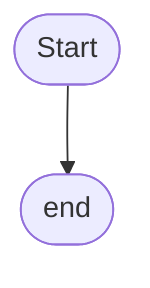
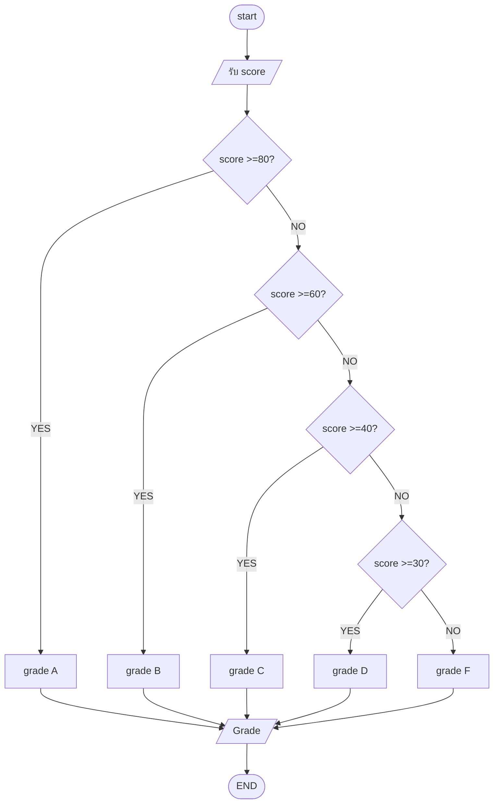
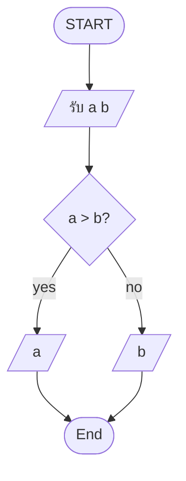
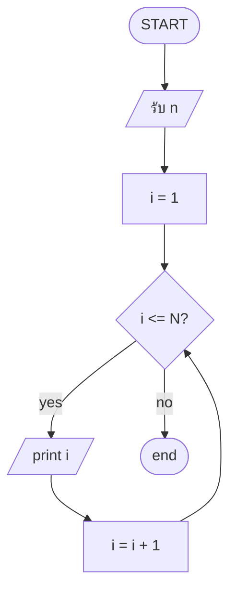

```mermaid
flowchart TD
A([Start]) --> B([end])
```

---

```mermaid
flowchart TD
	Start([start]) --> Input[/รับ score/]
	Input --> D1{score >=80?}
	D1 -->|YES| A[grade A]
	D1 -->|NO| D2{score >=60?}
	D2 -->|YES| B[grade B]
	D2 -->|NO| D3{score >=40?}
	D3 -->|YES| C[grade C]
	D3 -->|NO| D4{score >=30?}
	D4 -->|YES| D[grade D]
	D4 -->|NO| F[grade F]
A & B & C & D & F  --> Output[/Grade/]
	Output --> END([END])
```

---

```mermaid
flowchart TD
	start([START]) --> input[/รับ a b/]
	input --> X1{a > b?}
	X1 -->|yes| A[/a/]
	X1 -->|no| B[/b/]

	A & B --> output([End])
```

---

```mermaid
flowchart TD
	start([START]) --> n[/รับ n/]
	n --> i[i = 1]
	i --> A{ i <= N?}
	A -->|yes| B[/print i/]
	A -->|no| output([end])
	B --> C[i = i +  1]
	C --> A

```
