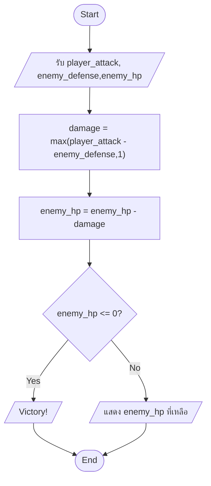
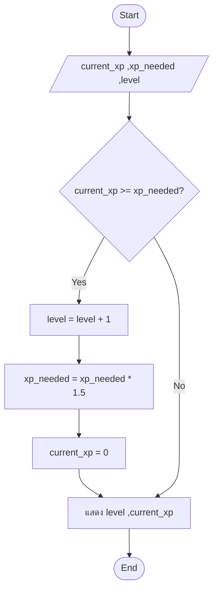
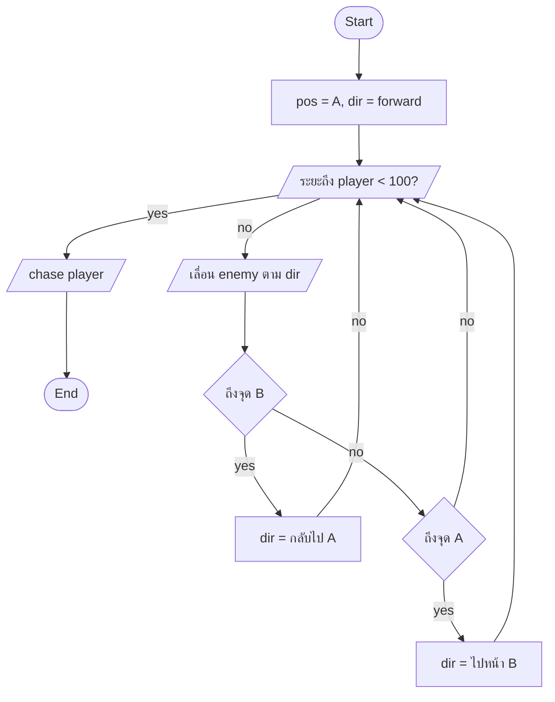

```mermaid
flowchart TD

Start([Start]) --> Input[/รับ player_attack, enemy_defense,enemy_hp/]
Input --> Calc["damage = max(player_attack - enemy_defense,1)"]
Calc --> Reduce["enemy_hp = enemy_hp - damage"]
Reduce --> D1{enemy_hp <= 0?}
D1 -->|Yes| Win[/Victory!/]
D1 -->|No| Show[/แสดง enemy_hp ที่เหลือ/]
Win & Show --> End([End])
```

---

```mermaid
flowchart TD

start([Start]) --> input[/current_xp ,xp_needed ,level/]
input --> A{current_xp >= xp_needed?}
A -->|Yes| A1[level = level + 1]
A1 --> A2[xp_needed = xp_needed * 1.5]
A2 --> A3[current_xp = 0]
A3 --> B[แสดง level ,current_xp]
A -->|No| B
B --> End([End])
```

---

```mermaid
flowchart TD

start([Start]) --> input[pos = A, dir = forward]
input --> P[/ระยะถึง player < 100?/]
P -->|yes| A[/chase player/]
A --> End([End])

P -->|no| B[/เลื่อน enemy ตาม dir /]
B --> C{ถึงจุด B}
C -->|yes| D[dir = กลับไป A]
D -->|no| P
C -->|no| E{ถึงจุด A}
E -->|yes| F[dir = ไปหน้า B]
E -->|no| P
F --> P
```
